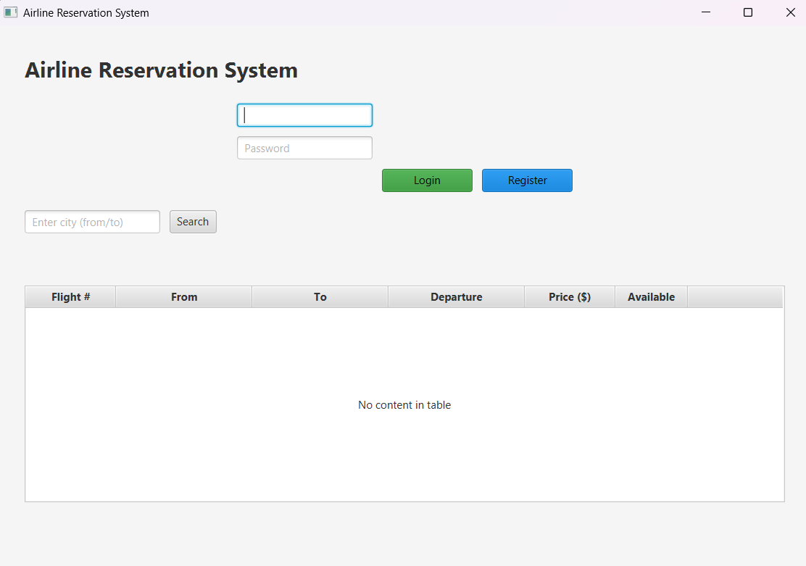
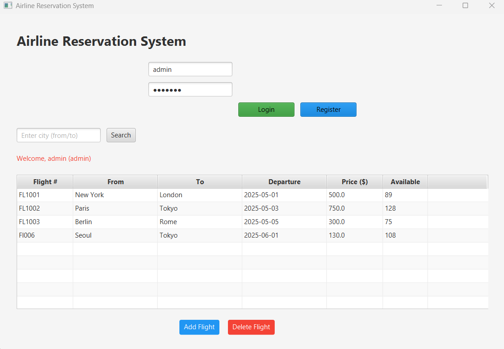
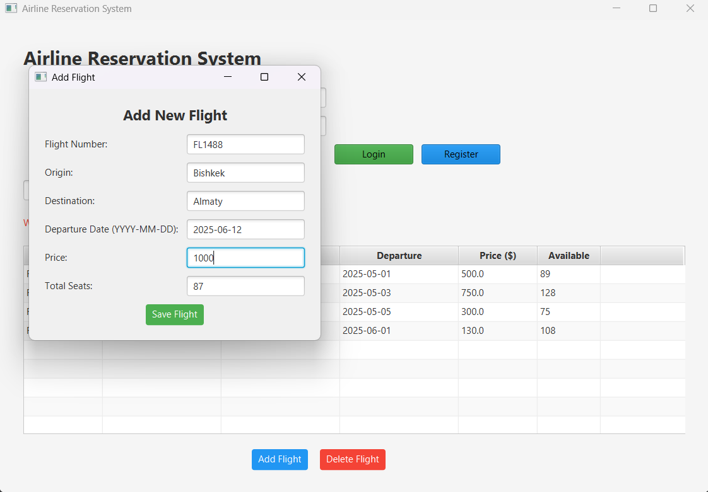
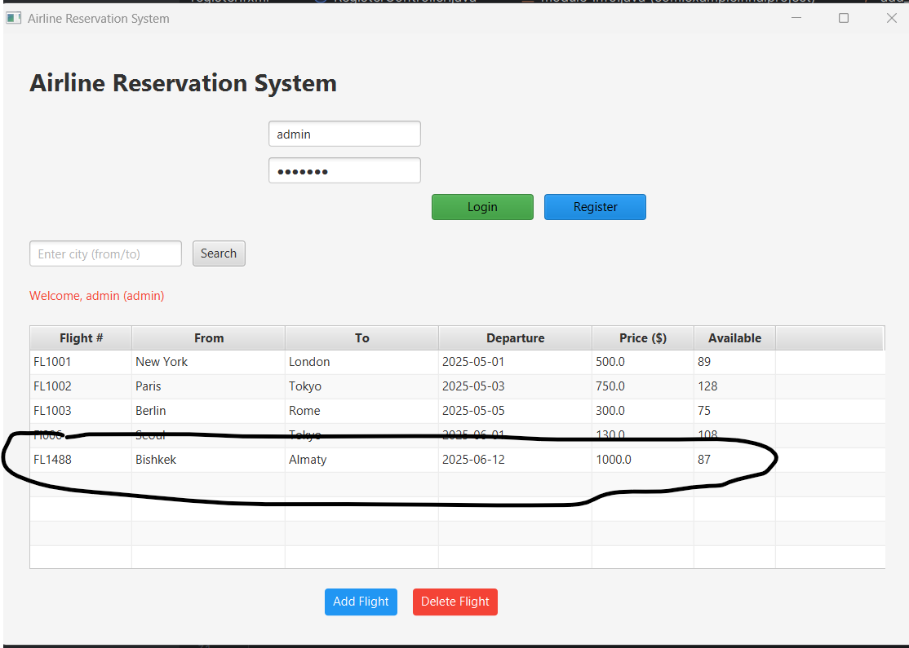
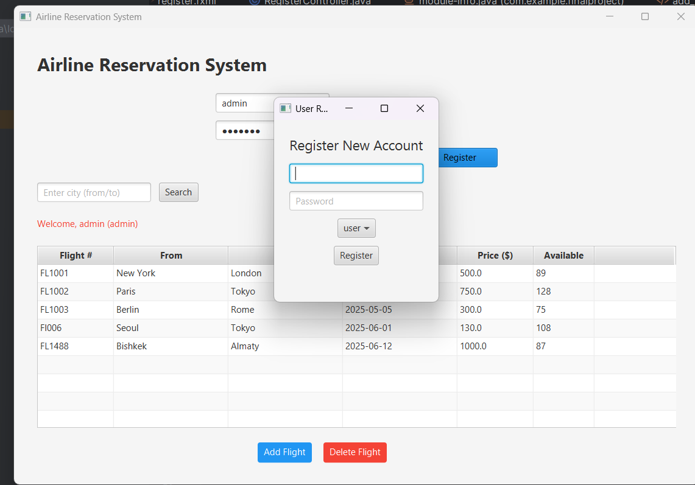
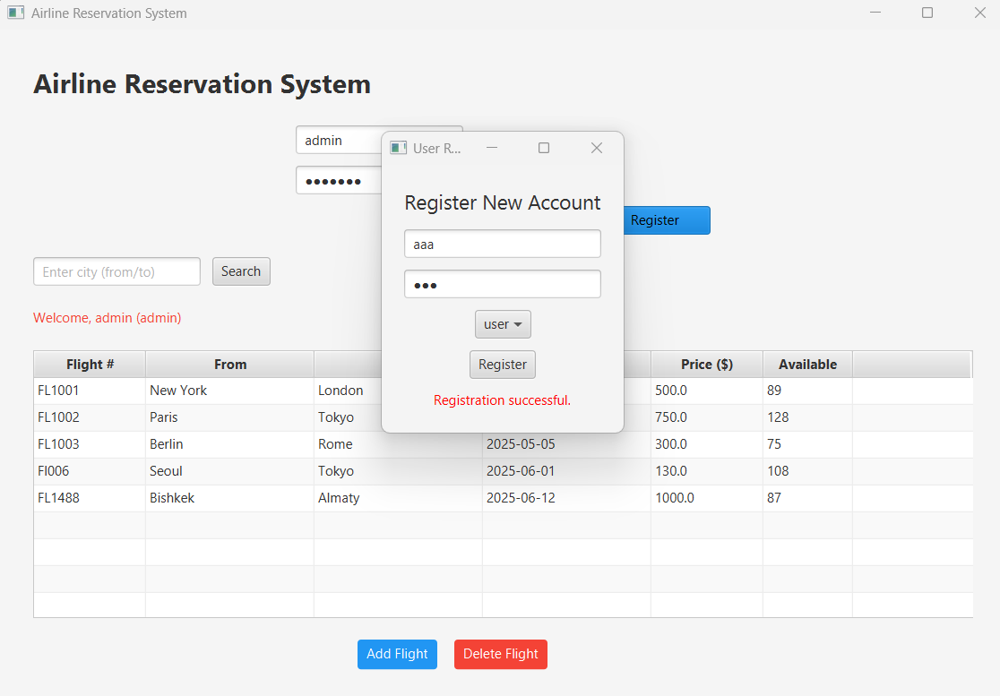
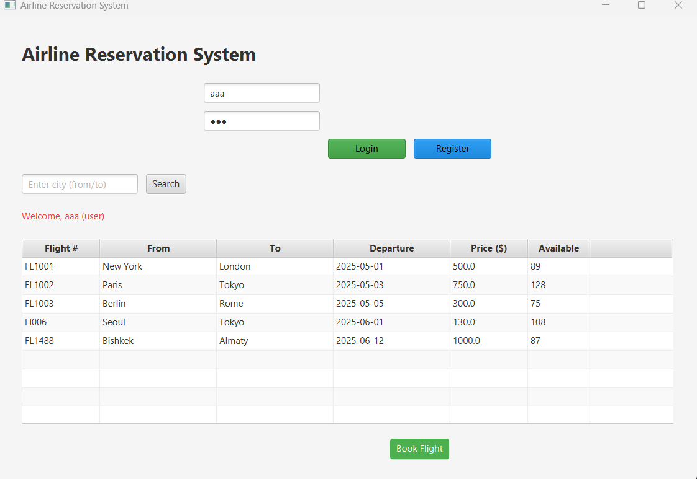

# Airline Reservation System . Student ID: 240141005
Name: Mariyam Usubalieva
Group:ComCEH-24

##  Description
This is a JavaFX-based desktop application for booking airline tickets. The system allows users to register, login, view available flights, and book tickets. Admins can manage flight information.

##  Objectives
- Develop a user-friendly interface for booking flights.
- Implement role-based authentication for customers and admins.
- Allow admins to add, update, and delete flight records.
- Enable customers to book and view their flights.
- Use MySQL for persistent storage.

# Documentation 
This project is a Flight Booking System developed using Java and Spring Boot, with a simple graphical interface using JavaFX or Swing. The system allows user registration, login, flight viewing, and booking. Admins can add flights to the system. The entire system is built to work with in-memory data storage without a database.

Algorithms Used
The system uses basic linear search and conditional logic for core functionalities:

Flight Search by ID: A simple for-loop is used to iterate through the list of available flights to match the input Flight ID.

User Authentication: When a user attempts to log in, the system checks whether the username exists in the user map and whether the password matches.

Booking Process: The selected flight object is added to the logged-in user's list of booked flights. This simulates booking confirmation.

Form Validation: Input fields for registration, login, and flight creation are validated to ensure they are not empty.

Data Structures Used
The application uses Java’s built-in collections:

List<Flight> is used to store all available flights.

Map<String, User> is used to store and retrieve users using their username as a key.

Each User object also contains a List<Flight> to track their bookings.

These collections act as an in-memory simulation of a database.

Modules and Classes
Main: The application entry point that starts the program.

Flight: A class representing each flight with fields for ID, destination, and date/time.

User: A class representing the user, storing their username, password, and booked flights.

RegisterController: Handles new user registration and form validation.

BookingController: Allows users to book flights and view their bookings.

AddFlightController: Allows admins to add flights to the system.

MainController: Controls screen navigation and central operations of the app.

Challenges Faced
Session Handling: Tracking the currently logged-in user without persistent session management was handled manually by storing a reference to the active user.

In-memory Data Persistence: Since no database is used, data is stored in memory only during runtime. Restarting the application resets all data.

Validation: Preventing null or empty values from crashing the app required manual validation for all input fields.

Scene Navigation: Managing transitions between multiple screens in JavaFX or Swing was initially complex and required centralized control logic.

NullPointerException: Care had to be taken to handle cases where lists (e.g., booked flights) might be empty or uninitialized.

This documentation outlines the internal logic, components, and development challenges of the project in a clear and concise manner. It reflects the simplicity and effectiveness of using core Java with Spring Boot for basic management systems.

# Tests
## Login panel

## Login like admin

## In admin you can add or delete

## Added in list

## Also you can register like user

## And this is user panel

# Project Requirement 

This list defines the key features and deliverables that must be implemented in the project to achieve its objectives.

1. **User Registration**  
   - Users must be able to register with a unique username, password, and role (user/admin).

2. **User Login Authentication**  
   - Registered users must log in with valid credentials to access the system.

3. **Role-Based Access Control**  
   - The system must distinguish between admin and regular users to enable role-specific functionality.

4. **Admin: Add Flight Information**  
   - Admin users must be able to add new flight records with details such as flight number, origin, destination, date, price, and seat count.

5. **View Available Flights**  
   - Users must be able to view a list of all available flights from the database.

6. **Book Flights**  
   - Users must be able to select a flight, specify the number of tickets, and confirm the booking.

7. **Seat Availability Validation**  
   - The system must ensure there are enough available seats before confirming a booking.

8. **Save Booking Information**  
   - Each booking must be recorded in the `bookings` table with the user’s name, flight number, and quantity of tickets.

9. **View User Bookings**  
   - Users must be able to view their own bookings in a table format.

10. **Graphical User Interface (GUI)**  
    - The system must provide a user-friendly GUI using JavaFX with navigation between scenes.

11. **Database Integration (MySQL)**  
    - The application must connect to a MySQL database to store and retrieve flight, user, and booking information.

12. **Prepared Statements for Security**  
    - All database interactions must use `PreparedStatement` to prevent SQL injection.

13. **Project Structured with MVC Principles**  
    - The code must follow a clear separation between UI (FXML), logic (controllers), and data (database).

